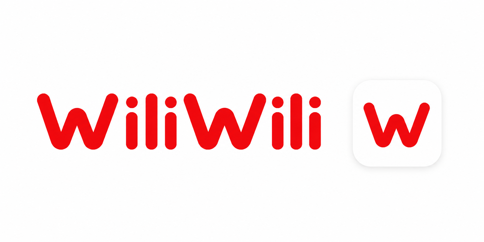

<p align="center">
  
</p>

<p align="center">
  <a href="#功能">功能</a> ·
  <a href="#快速开始">快速开始</a> ·
  <a href="#技术栈">技术栈</a> ·
  <a href="#架构">架构</a> ·
  <a href="#数据源">数据源</a> ·
  <a href="#许可">许可</a>
</p>

<p align="center">
  
  
  
  
</p>

---

## 功能

- **首页推荐** — 推荐与热门双数据源，支持无限滚动
- **用户动态** — 关注动态时间线，图文内容自动富化显示原文（需登录）
- **视频搜索** — 关键词搜索，结果列表无限加载
- **视频详情** — 封面、标题、UP 主信息、播放量统计，支持内嵌播放与一键全屏
- **全屏播放** — ExoPlayer 横屏沉浸式播放，音视频分离流合并
- **用户主页** — 查看 UP 主视频与动态，支持 Tab 切换和无限滚动
- **动态详情** — 图文动态完整展示，通过 Bilibili 详情接口获取富化内容
- **WebView 登录** — 加载官方登录页，自动提取并加密存储 Cookie

## 快速开始

```shell
# Debug 构建
./gradlew assembleDebug

# 发布签名构建（需配置 keystore）
./gradlew assembleRelease
```

Debug APK 输出至 `app/build/outputs/apk/debug/app-debug.apk`。

发布签名构建需要在项目根目录创建 `keystore.properties`：

```properties
storeFile=../your-keystore.jks
keyAlias=your-alias
storePassword=xxx
keyPassword=xxx
```

## 技术栈

| Category | Choice |
|---|---|
| 语言 | Kotlin |
| UI 框架 | Jetpack Compose + Material3 |
| 导航 | Navigation Compose |
| 网络 | OkHttp 4.12（CookieJar + WBI 签名） |
| 序列化 | kotlinx.serialization |
| 视频播放 | Media3 ExoPlayer（DASH 音视频分离流） |
| 图片加载 | Coil |
| 安全存储 | EncryptedSharedPreferences |
| 登录 | WebView + Cookie 自动提取 |

## 架构

采用单模块分层架构，职责清晰：

- **UI 层** — Compose 屏幕与组件，通过回调与导航驱动页面流转
- **Repository 层** — 封装所有数据获取逻辑，解耦 API 与 UI
- **API 层** — OkHttp 客户端封装，统一处理 Cookie、WBI 签名、UA
- **Session 层** — 登录态加密存储与管理

页面导航由 Navigation Compose 统一编排，支持自定义过渡动画。

## 数据源

内容来自 Bilibili 官方网页端开放接口：

- **首页** — 推荐 Feed + 热门 Popular 双接口兜底
- **动态** — 聚合动态 Feed API，图文项通过 Detail API 补充原文
- **播放** — 优先接口获取 DASH 流，失败回退 HTML 页面解析
- **用户空间** — WBI 签名接口

> 接口行为可能随 Bilibili 前端更新而变化。

## 许可

[MIT License](LICENSE) © 2025 CaseyWon
